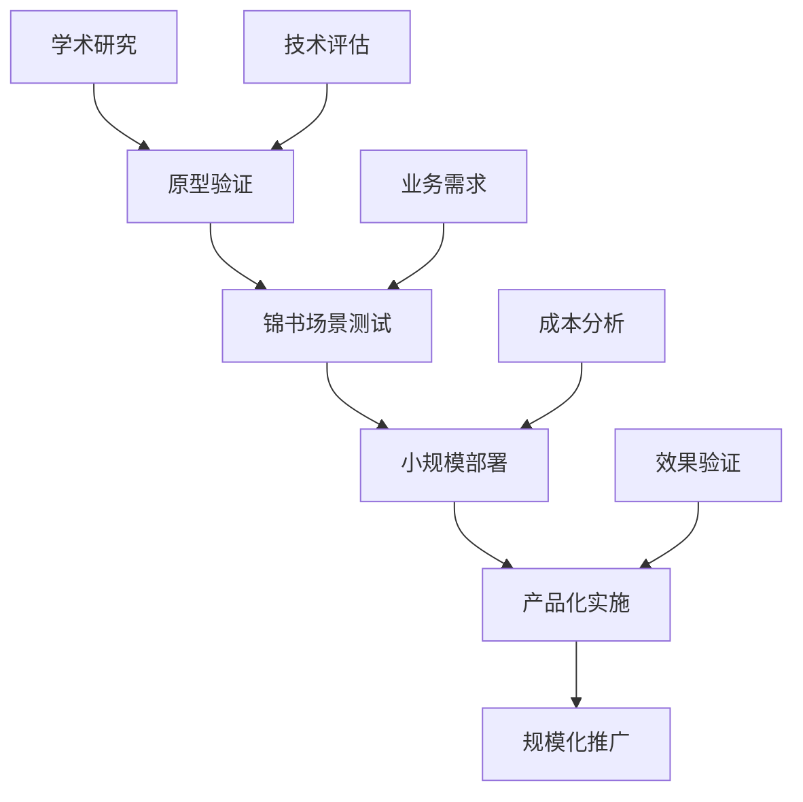

# AI前沿研究追踪系统

> **定位**：让你成为AI+教育领域的技术专家，持续追踪最新的学术研究和行业动态

## 🎯 追踪目标

**"学术研究 → 开源项目 → 行业应用"**的完整追踪链条，确保锦书教育平台始终保持技术领先优势。

## 📊 追踪方法论

### 每日扫描 (15分钟)
- **Hugging Face Trending**：最新模型和数据集
- **Arxiv摘要速读**：AI教育相关论文摘要
- **技术卡片更新**：更新知识库中的技术信息

### 每周深度研究 (2小时)
- **重点论文精读**：选择2-3篇核心论文深度分析
- **开源项目实验**：Fork并测试最有潜力的项目
- **技术趋势分析**：整理本周技术动态和趋势

### 每月综合报告 (1天)
- **技术成熟度评估**：评估各项技术的发展阶段
- **锦书应用规划**：制定基于前沿技术的产品规划
- **知识库更新**：整合月度研究成果

---

## 📁 目录结构

### [01-论文速读系统](./01-论文速读系统/)
AI辅助论文阅读和知识提取系统，快速掌握论文核心价值

### [02-开源项目追踪](./02-开源项目追踪/)
最有潜力的AI+教育开源项目监控和实验

### [03-行业报告库](./03-行业报告库/)
Gartner、麦肯锡等权威机构的AI教育行业报告

---

## 🔍 重点研究领域

### 核心研究方向
```yaml
大模型教育应用:
  - LLM-as-a-Judge in Education
  - Chain-of-Thought for Mathematical Reasoning
  - Multi-modal Learning in STEM Education
  - Personalized Learning with Large Models

AI Agent教育系统:
  - Multi-Agent Tutoring Systems
  - Collaborative Learning Agents
  - Adaptive Learning Orchestrators
  - Emotional Support Agents

知识图谱与RAG:
  - Educational Knowledge Graphs
  - GraphRAG for Curriculum Design
  - Personalized Retrieval for Learning
  - Cross-lingual Educational QA

生成式教育内容:
  - Diffusion Models for Educational Content
  - Automated Exercise Generation
  - Interactive Learning Material Creation
  - Cultural Adaptation in Content Gen
```

### 关键技术指标追踪
| 技术方向 | 核心指标 | 当前水平 | 目标水平 | 锦书应用价值 |
|---------|----------|----------|----------|-------------|
| 数学推理能力 | GSM8K准确率 | 85% | 95% | 极高 |
| 多语言支持 | 语言数量 | 20+ | 50+ | 高 |
| 推理速度 | 响应时间 | 2-5秒 | <1秒 | 中高 |
| 成本效益 | 每次调用成本 | $0.1 | $0.01 | 极高 |

---

## 🚀 快速追踪工具链

### AI辅助论文阅读
```python
import arxiv
import openai
from scholarly import scholarly

class PaperReadingAssistant:
    """AI辅助论文阅读助手"""

    def __init__(self):
        self.client = openai.Client()
        self.summarizer = PaperSummarizer()
        self.extractor = InsightExtractor()

    async def process_paper(self, arxiv_id: str) -> dict:
        """处理单篇论文"""
        # 1. 获取论文信息
        paper = self.get_paper_info(arxiv_id)

        # 2. 提取摘要和关键信息
        summary = await self.summarizer.summarize_paper(paper)

        # 3. 分析教育应用潜力
        education_potential = await self.analyze_education_potential(paper, summary)

        # 4. 提取实施建议
        implementation_hints = await self.extract_implementation_hints(paper)

        # 5. 生成技术卡片
        tech_card = self.generate_tech_card(paper, summary, education_potential)

        return {
            'paper_info': paper,
            'summary': summary,
            'education_potential': education_potential,
            'implementation_hints': implementation_hints,
            'tech_card': tech_card
        }

    async def analyze_education_potential(self, paper, summary) -> dict:
        """分析论文的教育应用潜力"""
        prompt = f"""
        作为锦书教育的AI技术顾问，请分析以下论文的教育应用价值：

        论文标题: {paper.title}
        摘要: {summary.abstract}
        核心贡献: {summary.key_contributions}

        请从以下角度分析：
        1. 技术创新点及其教育价值
        2. 在锦书平台的具体应用场景
        3. 实施的技术难度和资源需求
        4. 预期的业务效果和ROI
        5. 与现有技术的竞争优势

        请给出具体的实施建议和风险评估。
        """

        analysis = await self.client.chat.completions.create(
            model="gpt-4",
            messages=[{"role": "user", "content": prompt}],
            temperature=0.3
        )

        return {
            'potential_score': self.extract_potential_score(analysis.choices[0].message.content),
            'application_scenarios': self.extract_scenarios(analysis.choices[0].message.content),
            'implementation_difficulty': self.extract_difficulty(analysis.choices[0].message.content),
            'business_value': self.extract_business_value(analysis.choices[0].message.content),
            'detailed_analysis': analysis.choices[0].message.content
        }

    def generate_tech_card(self, paper, summary, potential) -> dict:
        """生成技术追踪卡片"""
        return {
            'card_id': f"paper_{paper.arxiv_id}_{datetime.now().strftime('%Y%m%d')}",
            'title': paper.title,
            'authors': paper.authors,
            'date': paper.published_date,
            'arxiv_id': paper.arxiv_id,
            'category': 'AI_Education',
            'potential_score': potential['potential_score'],
            'jinshu_applications': potential['application_scenarios'],
            'implementation_status': 'research',
            'next_actions': self.generate_next_actions(potential),
            'created_at': datetime.now().isoformat()
        }
```

### 开源项目监控系统
```python
import requests
from github import Github

class OpenSourceProjectMonitor:
    """开源项目监控系统"""

    def __init__(self, github_token: str):
        self.github = Github(github_token)
        self.watchlist = self.load_watchlist()
        self.alert_manager = AlertManager()

    def monitor_projects(self):
        """监控关注的开源项目"""
        updates = []

        for project in self.watchlist:
            project_updates = self.check_project_updates(project)
            if project_updates:
                updates.append({
                    'project': project,
                    'updates': project_updates,
                    'jinshu_relevance': self.assess_jinshu_relevance(project, project_updates)
                })

        # 发送重要更新警报
        self.send_important_update_alerts(updates)

        return updates

    def assess_jinshu_relevance(self, project, updates) -> dict:
        """评估项目对锦书的关联度"""
        relevance_score = 0
        application_scenarios = []

        # 检查技术栈匹配度
        if any(tech in project.description.lower() for tech in ['education', 'learning', 'tutoring']):
            relevance_score += 0.3

        # 检查更新内容的重要性
        for update in updates:
            if 'performance' in update['description'].lower():
                relevance_score += 0.2
            if 'api' in update['description'].lower():
                relevance_score += 0.2

        # 检查与锦书现有技术的互补性
        complementary_score = self.assess_technical_complementarity(project)
        relevance_score += complementary_score

        return {
            'overall_score': min(1.0, relevance_score),
            'application_scenarios': self.identify_application_scenarios(project),
            'technical_risks': self.identify_technical_risks(project),
            'implementation_complexity': self.assess_implementation_complexity(project)
        }
```

---

## 📈 研究质量评估框架

### 论文评估标准
```yaml
技术创新性 (30%):
  - 是否提出了新的方法或架构
  - 是否解决了现有技术的局限性
  - 技术方案的原创性和独特性

教育适用性 (25%):
  - 是否针对真实的教育问题
  - 技术方案在教育场景的可操作性
  - 对学习效果的潜在提升

实证效果 (20%):
  - 实验设计的严谨性
  - 基准模型的公平对比
  - 统计显著性和效果大小

可复现性 (15%):
  - 代码和数据的公开程度
  - 实验设置的详细程度
  - 第三方验证的可能性

锦书商业价值 (10%):
  - 与锦书现有产品的契合度
  - 实施成本和收益预估
  - 竞争优势和差异化
```

### 项目评估矩阵
| 维度 | 权重 | 评分标准 | 示例评分 |
|------|------|----------|----------|
| 技术成熟度 | 25% | 实验阶段(3)→原型(6)→产品(9) | 6 |
| 社区活跃度 | 20% | Star数、Fork数、Commit频率 | 7 |
| 文档质量 | 15% | README完整性、API文档、示例代码 | 8 |
| 锦书适配度 | 30% | 技术栈匹配、功能契合、实施难度 | 9 |
| 维护状态 | 10% | 最近更新、Issue响应、版本发布 | 7 |

---

## 🎯 锦书技术影响评估

### 技术转化路径


### 影响力追踪指标
```python
class TechnologyImpactTracker:
    """技术影响力追踪器"""

    def __init__(self):
        self.metrics_collector = MetricsCollector()
        self.impact_calculator = ImpactCalculator()

    def track_technology_impact(self, tech_id: str) -> dict:
        """追踪技术的影响力"""

        # 学术影响力
        academic_impact = self.calculate_academic_impact(tech_id)

        # 技术影响力
        technical_impact = self.calculate_technical_impact(tech_id)

        # 商业影响力
        business_impact = self.calculate_business_impact(tech_id)

        # 教育影响力
        educational_impact = self.calculate_educational_impact(tech_id)

        return {
            'tech_id': tech_id,
            'academic_impact': academic_impact,
            'technical_impact': technical_impact,
            'business_impact': business_impact,
            'educational_impact': educational_impact,
            'overall_score': self.calculate_overall_score(
                academic_impact, technical_impact,
                business_impact, educational_impact
            ),
            'trend_analysis': self.analyze_impact_trend(tech_id)
        }

    def calculate_educational_impact(self, tech_id: str) -> dict:
        """计算教育影响力"""
        return {
            'student_learning_outcomes': self.assess_learning_improvements(tech_id),
            'teacher_efficiency_gains': self.assess_teacher_efficiency(tech_id),
            'educational_equity_impact': self.assess_equity_impact(tech_id),
            'scalability_in_education': self.assess_educational_scalability(tech_id)
        }
```

---

## 🔗 核心资源库

### 关键学术会议和期刊
```yaml
顶级会议:
  AI/ML: NeurIPS, ICML, ICLR, AAAI, CVPR
  教育技术: EDM, LAK, ICER, CHI
  NLP: ACL, EMNLP, NAACL
  教育交叉: AIED, ITS, ICCE

重要期刊:
  人工智能: JMLR, T-PAMI, AIJ
  教育技术: IJAIED, BJET, CIE
  跨学科: IEEE TLT, Computers & Education
```

### 必关注的研究机构
```yaml
学术机构:
  - Stanford AI Lab
  - MIT CSAIL
  - CMU ML Department
  - Berkeley AI Research
  - University of Washington AIL

企业研究院:
  - Google Research (Education)
  - Microsoft Research (Learning)
  - Meta AI (Multimodal Learning)
  - OpenAI (Education Applications)
  - Anthropic (Claude in Education)
```

---

## 📅 月度研究计划

### 研究时间分配
```yaml
第1周 (15小时):
  论文追踪: 5小时
  技术分析: 4小时
  锦书应用思考: 3小时
  知识库更新: 3小时

第2周 (10小时):
  深度论文阅读: 6小时
  开源项目实验: 4小时

第3周 (15小时):
  技术原型开发: 8小时
  效果评估: 4小时
  趋势分析: 3小时

第4周 (10小时):
  月度报告撰写: 6小时
  下月计划制定: 4小时
```

---

## 🚨 研究警示机制

### 技术风险评估
```python
class TechnologyRiskAssessment:
    """技术风险评估系统"""

    def __init__(self):
        self.risk_indicators = [
            'hype_cycle_stage',
            'technical_maturity',
            'implementation_complexity',
            'resource_requirements',
            'regulatory_compliance'
        ]

    def assess_technology_risk(self, technology_info: dict) -> dict:
        """评估技术风险"""
        risk_scores = {}

        # 技术过时风险
        if technology_info.get('hype_cycle_stage') == 'peak_of_inflated_expectations':
            risk_scores['obsolescence_risk'] = 0.8

        # 实施复杂度风险
        complexity = technology_info.get('implementation_complexity', 'medium')
        risk_scores['implementation_risk'] = self.map_complexity_to_risk(complexity)

        # 资源依赖风险
        resource_requirements = technology_info.get('resource_requirements', {})
        risk_scores['resource_risk'] = self.assess_resource_risk(resource_requirements)

        # 合规风险
        regulatory_issues = technology_info.get('regulatory_issues', [])
        risk_scores['compliance_risk'] = len(regulatory_issues) * 0.2

        overall_risk = sum(risk_scores.values()) / len(risk_scores)

        return {
            'overall_risk_score': overall_risk,
            'detailed_risks': risk_scores,
            'mitigation_strategies': self.generate_mitigation_strategies(risk_scores),
            'recommendation': self.generate_recommendation(overall_risk)
        }
```

*责任维护人：[待指定] | 研究评估周期：每周一次*