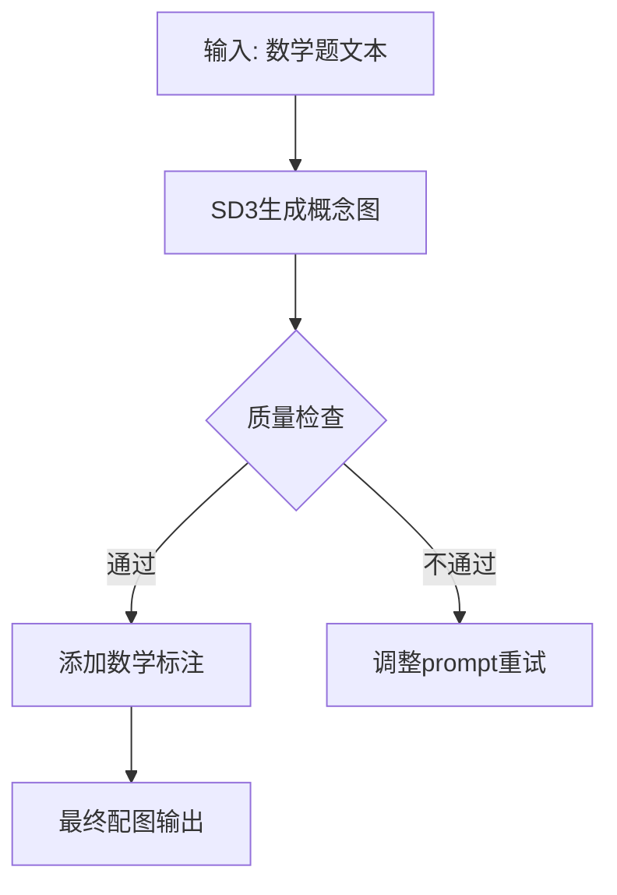
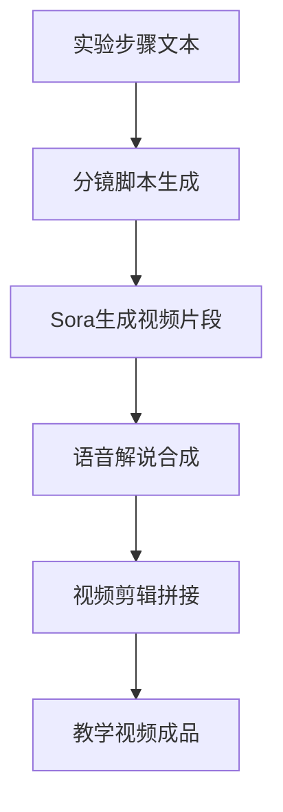

# 多模态生成技术模块

## 🎯 锦书教育应用定位

将最新的视觉生成技术应用到教育内容生产中，实现"文字→图像→视频"的自动化内容创作。

## 🖼️ 技术卡片库

### Stable Diffusion 3
```yaml
基本信息:
  原理: 扩散模型 + Transformer架构
  成本: API调用 $0.02/张，本地部署显存需求8GB
  发布: 2024年12月

锦书应用场景:
  化学实验图: 生成试管、烧杯等实验器材图
  物理示意图: 生成力学、电学等物理概念图
  历史场景还原: 生成古代建筑、服饰等历史图片
  生物结构图: 生成细胞、器官等生物学图示

技术优势:
  生图质量高，风格可控性强
  支持negative prompt，避免错误概念
  开源生态丰富，可本地部署

使用限制:
  复杂物理规则生成需要多次迭代
  文字生成能力有限，需要后期处理
  对GPU性能要求较高
```

### Sora视频生成 (概念验证)
```yaml
基本信息:
  原理: Diffusion Transformer (DiT)
  成本: 预计$0.1-0.5/秒，商业许可待定
  状态: 2025年预计开放API

锦书应用场景:
  化学实验演示: 自动生成实验操作视频
  物理现象模拟: 生成力学、电学等现象动画
  历史事件重现: 生成历史场景视频
  数学可视化: 生成函数图像变化过程

预期效果:
  内容生产效率提升: 200%
  视频质量: 接近专业拍摄水平
  成本降低: 相比拍摄节省80%

技术风险:
  API成本可能较高
  生成时间可能较长
  版权问题需要明确
```

### Midjourney V6
```yaml
基本信息:
  原理: 专有架构，基于CLIP+扩散
  成本: $30/月基础版，$60/月标准版
  特色: 艺术性强，社区活跃

锦书应用场景:
  课件封面设计: 生成课程相关的艺术封面
  激励海报制作: 生成学习激励类海报
  故事插画: 生成语文、英语课文配图
  校园场景: 生成虚拟校园环境图

使用建议:
  适合对艺术性要求高的场景
  社区prompt可获得优质效果
  商业使用需要授权
```

## 🎨 锦书内容生成工作流

### 数学题配图生成流程


### 实验视频生成规划


## 📊 ROI分析

### 人工 vs AI内容生产成本对比

| 内容类型 | 人工制作成本 | AI生成成本 | 时间节省 | 质量评分 |
|---------|-------------|-----------|---------|---------|
| 数学题配图 | ¥50/张 | ¥2/张 | 95% | 8.5/10 |
| 化学实验图 | ¥200/张 | ¥15/张 | 92% | 8.0/10 |
| 课件封面 | ¥300/个 | ¥20/个 | 90% | 9.0/10 |
| 实验演示视频 | ¥2000/个 | ¥200/个 | 85% | 7.5/10 |

## 🛠️ 技术集成方案

### 推荐技术栈
```yaml
图像生成:
  主要: Stable Diffusion 3 + ComfyUI
  备用: Midjourney API
  本地部署: RTX 4090 + 24GB显存

视频生成:
  等待: Sora API (预计2025 Q2)
  替代: RunwayML + Pika Labs
  后期: CapCut API自动剪辑

内容管理:
  存储: 阿里云OSS + CDN加速
  审核: 人工审核 + AI内容检测
  版本控制: Git LFS管理素材文件
```

## 📈 实施路线图

### Phase 1: 图像生成集成 (2025 Q1)
- [ ] Stable Diffusion本地部署
- [ ] 数学题配图模板开发
- [ ] 质量控制流程建立
- [ ] 成本效益评估

### Phase 2: 视频生成探索 (2025 Q2)
- [ ] Sora API申请测试
- [ ] 实验视频生成模板
- [ ] 语音合成集成
- [ ] 视频质量优化

### Phase 3: 全面内容自动化 (2025 Q3)
- [ ] 多模态内容 pipeline
- [ ] 个性化内容生成
- [ ] 成本控制机制
- [ ] 版权管理体系

*责任维护人：[待指定] | 下次技术评估：2025-01-15*