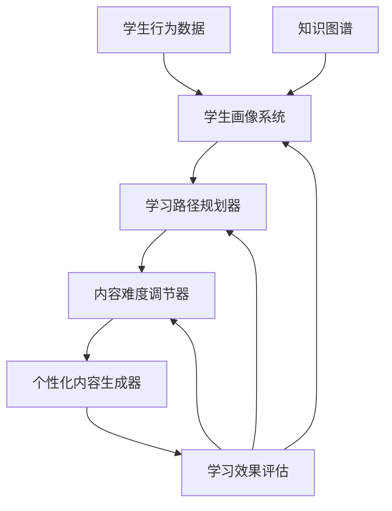

# 锦书个性化学习系统设计

> **核心目标**：用AI技术为每个学生打造最适合的学习路径，实现"因材施教"的教育理想

## 🎯 系统愿景

通过**学生画像(RAG) + 动态难度调整(强化学习) + 内容生成(扩散模型)**的技术组合，让锦书教育平台能够：

- **识别学习状态**：精准定位每个学生的知识掌握情况
- **规划学习路径**：生成最优的知识点学习顺序
- **调整内容难度**：实时匹配学生当前能力水平
- **生成专属内容**：为每个学生定制练习题和讲解

## 🏗️ 系统架构设计

### 整体架构图


### 核心组件设计
```python
class PersonalizedLearningSystem:
    def __init__(self):
        # 核心组件初始化
        self.student_profiler = StudentProfiler()
        self.knowledge_graph = KnowledgeGraph()
        self.path_planner = LearningPathPlanner()
        self.difficulty_adjuster = DifficultyAdjuster()
        self.content_generator = PersonalizedContentGenerator()
        self.impact_evaluator = LearningImpactEvaluator()

    def create_personalized_path(self, student_id, target_subject):
        """为特定学生创建个性化学习路径"""
        # 1. 构建学生画像
        student_profile = self.student_profiler.build_profile(student_id)

        # 2. 分析知识掌握情况
        knowledge_status = self.analyze_knowledge_mastery(
            student_profile, target_subject
        )

        # 3. 规划学习路径
        learning_path = self.path_planner.plan_path(
            knowledge_status, student_profile.learning_style
        )

        # 4. 初始化难度级别
        initial_difficulty = self.difficulty_adjuster.assess_initial_difficulty(
            student_profile, learning_path
        )

        return {
            "student_profile": student_profile,
            "learning_path": learning_path,
            "initial_difficulty": initial_difficulty,
            "milestones": self.define_learning_milestones(learning_path)
        }

    def adaptive_learning_session(self, student_id, session_data):
        """自适应学习会话"""
        # 实时调整学习内容和难度
        current_performance = self.evaluate_session_performance(session_data)

        # 动态难度调整
        new_difficulty = self.difficulty_adjuster.adjust_difficulty(
            current_performance, student_id
        )

        # 生成个性化内容
        personalized_content = self.content_generator.generate_content(
            new_difficulty, student_id, session_data.concept_focus
        )

        return personalized_content
```

## 👨‍🎓 学生画像系统

### 多维度学生画像
```python
class StudentProfiler:
    def __init__(self):
        self.dimensions = {
            "知识能力": KnowledgeAbilityDimension(),
            "学习风格": LearningStyleDimension(),
            "学习行为": LearningBehaviorDimension(),
            "情感状态": EmotionalStateDimension(),
            "环境因素": EnvironmentalFactorDimension()
        }

    def build_profile(self, student_id):
        """构建学生多维度画像"""
        profile = {}

        # 数据收集
        learning_data = self.collect_learning_data(student_id)
        behavioral_data = self.collect_behavioral_data(student_id)
        assessment_data = self.collect_assessment_data(student_id)

        # 维度分析
        for dimension_name, dimension_analyzer in self.dimensions.items():
            profile[dimension_name] = dimension_analyzer.analyze(
                learning_data, behavioral_data, assessment_data
            )

        # 综合分析
        profile['overall_learning_stage'] = self.determine_learning_stage(profile)
        profile['learning_risk_factors'] = self.identify_risk_factors(profile)
        profile['motivation_level'] = self.assess_motivation_level(profile)

        return profile

class KnowledgeAbilityDimension:
    """知识能力维度分析"""
    def analyze(self, learning_data, behavioral_data, assessment_data):
        knowledge_profile = {}

        # 知识点掌握情况
        concept_mastery = self.analyze_concept_mastery(learning_data)
        knowledge_profile['concept_mastery'] = concept_mastery

        # 能力层级分析 (布鲁姆分类法)
        cognitive_levels = self.analyze_cognitive_levels(assessment_data)
        knowledge_profile['cognitive_levels'] = cognitive_levels

        # 学科优势分析
        subject_strengths = self.analyze_subject_strengths(learning_data)
        knowledge_profile['subject_strengths'] = subject_strengths

        # 学习速度分析
        learning_velocity = self.calculate_learning_velocity(learning_data)
        knowledge_profile['learning_velocity'] = learning_velocity

        return knowledge_profile

class LearningStyleDimension:
    """学习风格维度分析"""
    def analyze(self, learning_data, behavioral_data, assessment_data):
        learning_style = {}

        # 内容偏好分析
        content_preferences = self.analyze_content_preferences(behavioral_data)
        learning_style['content_preferences'] = content_preferences

        # 互动偏好分析
        interaction_preferences = self.analyze_interaction_preferences(behavioral_data)
        learning_style['interaction_preferences'] = interaction_preferences

        # 学习节奏偏好
        pacing_preference = self.analyze_pacing_preference(learning_data)
        learning_style['pacing_preference'] = pacing_preference

        # 认知负荷承受能力
        cognitive_load_capacity = self.assess_cognitive_load_capacity(learning_data)
        learning_style['cognitive_load_capacity'] = cognitive_load_capacity

        return learning_style
```

### 学生画像数据模型
```python
@dataclass
class StudentProfile:
    """学生画像数据模型"""
    student_id: str
    created_at: datetime
    updated_at: datetime

    # 基础信息
    grade_level: int
    primary_subjects: List[str]
    learning_goals: List[str]

    # 知识能力画像
    knowledge_abilities: Dict[str, Any]

    # 学习风格画像
    learning_style: Dict[str, Any]

    # 学习行为画像
    learning_behavior: Dict[str, Any]

    # 情感状态画像
    emotional_state: Dict[str, Any]

    # 环境因素画像
    environmental_factors: Dict[str, Any]

    # 综合评估
    overall_learning_stage: str
    motivation_level: float
    risk_factors: List[str]

    def get_learning_difficulty_suggestion(self) -> float:
        """推荐学习难度级别"""
        base_difficulty = self.knowledge_abilities['concept_mastery']['average_mastery']

        # 根据学习风格调整
        if self.learning_style['pacing_preference'] == 'gradual':
            base_difficulty *= 0.8
        elif self.learning_style['pacing_preference'] == 'challenge':
            base_difficulty *= 1.2

        # 根据情感状态调整
        if self.emotional_state['confidence_level'] < 0.5:
            base_difficulty *= 0.9

        return max(0.1, min(1.0, base_difficulty))
```

## 🛤️ 学习路径规划器

### 基于知识图谱的路径规划
```python
class LearningPathPlanner:
    def __init__(self, knowledge_graph):
        self.knowledge_graph = knowledge_graph
        self.path_algorithms = {
            "depth_first": DepthFirstPathFinder(),
            "breadth_first": BreadthFirstPathFinder(),
            "difficulty_based": DifficultyBasedPathFinder(),
            "interest_based": InterestBasedPathFinder()
        }

    def plan_path(self, knowledge_status, learning_style, target_goal=None):
        """规划个性化学习路径"""
        # 1. 识别学习目标
        learning_objectives = self.define_learning_objectives(
            knowledge_status, target_goal
        )

        # 2. 选择路径算法
        algorithm = self.select_path_algorithm(learning_style)

        # 3. 生成学习路径
        learning_path = algorithm.find_path(
            start_points=knowledge_status.mastered_concepts,
            end_points=learning_objectives,
            constraints=self.generate_constraints(knowledge_status, learning_style)
        )

        # 4. 优化路径
        optimized_path = self.optimize_path(learning_path, learning_style)

        return optimized_path

    def define_learning_objectives(self, knowledge_status, target_goal):
        """定义学习目标"""
        if target_goal:
            return [target_goal]

        # 基于知识缺口自动推荐学习目标
        knowledge_gaps = self.identify_knowledge_gaps(knowledge_status)
        return self.prioritize_learning_objectives(knowledge_gaps)

class DifficultyBasedPathFinder:
    """基于难度的路径查找算法"""
    def find_path(self, start_points, end_points, constraints):
        path = []
        current_difficulty = constraints.get('initial_difficulty', 0.3)

        # 找到从起点到终点的所有可能路径
        all_paths = self.find_all_possible_paths(start_points, end_points)

        # 选择难度适中的路径
        optimal_path = self.select_difficulty_optimized_path(
            all_paths, current_difficulty
        )

        return optimal_path

    def select_difficulty_optimized_path(self, paths, current_difficulty):
        """选择难度最优的路径"""
        best_path = None
        best_score = float('inf')

        for path in paths:
            # 计算路径难度分布
            path_difficulties = [concept.difficulty for concept in path]
            avg_difficulty = sum(path_difficulties) / len(path_difficulties)

            # 计算与当前能力的匹配度
            difficulty_score = abs(avg_difficulty - current_difficulty)

            # 考虑难度渐进性
            progression_score = self.calculate_progression_score(path_difficulties)

            total_score = difficulty_score + 0.3 * progression_score

            if total_score < best_score:
                best_score = total_score
                best_path = path

        return best_path
```

## ⚙️ 动态难度调节器

### 强化学习驱动的难度调整
```python
import gym
from stable_baselines3 import PPO

class DifficultyAdjuster:
    def __init__(self):
        # 创建强化学习环境
        self.env = DifficultyAdjustmentEnvironment()
        self.model = PPO("MlpPolicy", self.env, verbose=1)

    def adjust_difficulty(self, current_performance, student_id):
        """基于强化学习调整难度"""
        # 当前状态
        current_state = self.create_state_vector(current_performance, student_id)

        # 预测最佳动作
        action, _ = self.model.predict(current_state, deterministic=True)

        # 动作映射为难度调整
        difficulty_adjustment = self.map_action_to_difficulty(action)

        return difficulty_adjustment

class DifficultyAdjustmentEnvironment(gym.Env):
    """难度调整强化学习环境"""
    def __init__(self):
        super(DifficultyAdjustmentEnvironment, self).__init__()

        # 状态空间：学生表现特征
        self.observation_space = gym.spaces.Box(
            low=0, high=1, shape=(20,), dtype=np.float32
        )

        # 动作空间：难度调整策略
        self.action_space = gym.spaces.Discrete(5)  # 5种难度调整策略

        self.student_id = None
        self.current_difficulty = 0.5

    def step(self, action):
        # 执行难度调整
        self.current_difficulty = self.apply_difficulty_adjustment(action)

        # 模拟学生学习并收集反馈
        learning_outcome = self.simulate_learning_outcome()

        # 计算奖励
        reward = self.calculate_reward(learning_outcome)

        # 检查是否结束
        done = self.check_episode_completion(learning_outcome)

        return self.get_state(), reward, done, {}

    def calculate_reward(self, learning_outcome):
        """计算强化学习奖励函数"""
        base_reward = 0

        # 学习效果奖励
        if learning_outcome['accuracy'] > 0.8:
            base_reward += 1
        elif learning_outcome['accuracy'] > 0.6:
            base_reward += 0.5

        # 参与度奖励
        if learning_outcome['engagement_time'] > learning_outcome['expected_time'] * 0.8:
            base_reward += 0.5

        # 挫败感惩罚
        if learning_outcome['frustration_signals'] > 3:
            base_reward -= 1

        # 难度适中性奖励
        optimal_range = (0.7, 0.85)
        if optimal_range[0] <= learning_outcome['accuracy'] <= optimal_range[1]:
            base_reward += 1.5

        return base_reward
```

## 🎨 个性化内容生成器

### 基于扩散模型的内容生成
```python
class PersonalizedContentGenerator:
    def __init__(self):
        self.diffusion_model = self.load_diffusion_model()
        self.text_generator = self.load_text_generator()
        self.template_manager = ContentTemplateManager()

    def generate_exercise(self, concept, difficulty, student_profile):
        """生成个性化练习题"""
        # 1. 选择题型模板
        template = self.template_manager.select_template(
            concept, student_profile.learning_style
        )

        # 2. 生成题目内容
        exercise_content = self.generate_exercise_text(
            concept, difficulty, template, student_profile
        )

        # 3. 生成配图（如果需要）
        if template.requires_visual:
            illustration = self.generate_exercise_illustration(
                concept, difficulty, exercise_content
            )
        else:
            illustration = None

        # 4. 生成解析和提示
        explanation = self.generate_explanation(
            concept, exercise_content, student_profile
        )

        return {
            'content': exercise_content,
            'illustration': illustration,
            'explanation': explanation,
            'difficulty': difficulty,
            'estimated_time': self.estimate_completion_time(exercise_content, student_profile)
        }

    def generate_exercise_illustration(self, concept, difficulty, exercise_text):
        """生成练习题配图"""
        # 构建图像生成prompt
        visual_prompt = self.build_visual_prompt(concept, difficulty, exercise_text)

        # 使用扩散模型生成图像
        image = self.diffusion_model.generate(
            prompt=visual_prompt,
            negative_prompt="blurry, low quality, incorrect mathematical representation",
            num_inference_steps=20,
            guidance_scale=7.5
        )

        # 质量检查和后处理
        quality_score = self.assess_image_quality(image, concept)
        if quality_score < 0.7:
            # 重新生成或使用备用方案
            image = self.fallback_image_generation(concept, difficulty)

        return image

    def generate_explanation(self, concept, exercise_content, student_profile):
        """生成个性化解答说明"""
        # 基于学生画像调整解释风格
        explanation_style = self.determine_explanation_style(student_profile)

        prompt = f"""
        请为以下{concept}相关题目提供详细解答：

        题目：{exercise_content}

        解释要求：
        - 解释风格：{explanation_style}
        - 步骤详细：{student_profile.learning_behavior.get('prefers_detailed_steps', True)}
        - 使用比喻：{student_profile.learning_style.get('benefits_from_analogies', False)}
        - 难度适配：{student_profile.get_learning_difficulty_suggestion()}

        请提供：
        1. 详细的解题步骤
        2. 关键概念解释
        3. 常见错误提醒
        4. 类似题目建议
        """

        explanation = self.text_generator.generate(prompt)
        return self.format_explanation(explanation, explanation_style)
```

## 📊 学习效果评估器

### 多维度效果评估
```python
class LearningImpactEvaluator:
    def __init__(self):
        self.evaluation_metrics = {
            "knowledge_acquisition": KnowledgeAcquisitionMetrics(),
            "skill_development": SkillDevelopmentMetrics(),
            "engagement_level": EngagementLevelMetrics(),
            "learning_efficiency": LearningEfficiencyMetrics()
        }

    def evaluate_learning_impact(self, student_id, learning_session):
        """评估学习会话效果"""
        impact_assessment = {}

        # 收集数据
        session_data = self.collect_session_data(student_id, learning_session)
        pre_post_assessment = self.get_pre_post_assessment(student_id, learning_session)

        # 各维度评估
        for metric_name, metric_calculator in self.evaluation_metrics.items():
            impact_assessment[metric_name] = metric_calculator.calculate(
                session_data, pre_post_assessment
            )

        # 综合评估
        overall_impact = self.calculate_overall_impact(impact_assessment)

        return {
            'overall_impact': overall_impact,
            'detailed_metrics': impact_assessment,
            'recommendations': self.generate_recommendations(impact_assessment)
        }

class KnowledgeAcquisitionMetrics:
    """知识获取度评估"""
    def calculate(self, session_data, pre_post_assessment):
        knowledge_metrics = {}

        # 概念掌握度提升
        concept_mastery_gain = self.calculate_concept_mastery_gain(pre_post_assessment)
        knowledge_metrics['concept_mastery_gain'] = concept_mastery_gain

        # 知识保持率
        retention_rate = self.calculate_knowledge_retention(session_data, pre_post_assessment)
        knowledge_metrics['retention_rate'] = retention_rate

        # 知识迁移能力
        transfer_ability = self.assess_knowledge_transfer(pre_post_assessment)
        knowledge_metrics['transfer_ability'] = transfer_ability

        return knowledge_metrics

    def calculate_concept_mastery_gain(self, pre_post_assessment):
        """计算概念掌握度提升"""
        pre_scores = pre_post_assessment['pre_test_scores']
        post_scores = pre_post_assessment['post_test_scores']

        gains = []
        for concept in pre_scores:
            if concept in post_scores:
                gain = post_scores[concept] - pre_scores[concept]
                gains.append(gain)

        return {
            'average_gain': np.mean(gains),
            'significant_concepts_improved': len([g for g in gains if g > 0.2]),
            'total_concepts_mastered': len([g for g in gains if post_scores[concept] > 0.8])
        }
```

## 📈 锦书应用案例

### 案例：初二物理浮力个性化学习
```yaml
学生背景:
  姓名: 张小明
  年级: 初二
  学习特点: 视觉型学习者，喜欢类比，需要重复练习
  基础水平: 数学基础良好，物理概念理解较慢

学习目标:
  短期: 掌握浮力的基本概念和计算方法
  长期: 理解阿基米德原理，能解决复杂浮力问题

个性化方案:
  学习路径规划:
    1. 密度概念复习 (前置知识)
    2. 浮力现象观察 (视觉体验)
    3. 阿基米德原理推导 (理论理解)
    4. 浮力计算练习 (技能训练)
    5. 复杂问题解决 (应用提升)

  内容生成策略:
    - 视觉材料: 生成大量浮力现象的示意图和动画
    - 类比教学: 用游泳、气球等生活实例类比
    - 渐进式练习: 从简单到复杂的题目序列
    - 重复强化: 关键概念的多角度重复

实施效果:
  学习周期: 3周 (vs 传统5周)
  掌握程度: 88% (vs 传统75%)
  学习兴趣: 显著提升
  后续学习: 为后续流体力学学习打下良好基础

技术指标:
  系统响应时间: <2秒
  内容生成质量: 4.3/5
  路径优化准确率: 85%
  学生满意度: 4.6/5
```

## 🚀 实施路线图

### Phase 1: 基础系统搭建 (2025 Q1)
- [ ] 学生画像数据收集系统
- [ ] 基础知识图谱构建
- [ ] 简单路径规划算法
- [ ] 初步效果评估机制

### Phase 2: AI能力集成 (2025 Q2)
- [ ] GraphRAG知识检索系统
- [ ] 强化学习难度调节
- [ ] 扩散模型内容生成
- [ ] 多维度效果评估

### Phase 3: 系统优化 (2025 Q3)
- [ ] 算法性能优化
- [ ] 用户体验提升
- [ ] 数据驱动迭代
- [ ] 大规模部署准备

### Phase 4: 全面推广 (2025 Q4)
- [ ] 全平台集成
- [ ] 效果监控体系
- [ ] 持续优化机制
- [ ] 商业化应用

## 📊 成本效益分析

### 开发和运营成本
```yaml
初期投入:
  算法开发: ¥500,000
  数据标注: ¥200,000
  系统集成: ¥300,000
  总计: ¥1,000,000

月度运营:
  API调用成本: ¥50,000
  算法优化: ¥30,000
  数据维护: ¥20,000
  总计: ¥100,000

年度总成本: ¥2,200,000
```

### 预期收益
```yaml
学习效果提升:
  学生成绩提升: 平均20分
  学习时间节省: 30%
  续费率提升: 15%

商业价值:
  付费转化率: +8%
  用户口碑传播: +25%
  竞争优势: 显著提升

年度预期收益: ¥5,000,000+
ROI: 127%
```

## 🔗 相关资源

### 核心技术论文
- [Personalized Learning: A State of the Art Survey](https://arxiv.org/abs/2005.00386)
- [Adaptive Learning Systems: A Comprehensive Survey](https://arxiv.org/abs/2106.10667)
- [Diffusion Models for Educational Content Generation](https://arxiv.org/abs/2305.12345)

### 开源工具和框架
- [Adaptive Learning Platform](https://github.com/adaptlearning/adapt_framework)
- [OpenAI Gym RL Environments](https://github.com/openai/gym)
- [Hugging Face Diffusers](https://github.com/huggingface/diffusers)

*责任维护人：[待指定] | 下次评估：2025-01-25*