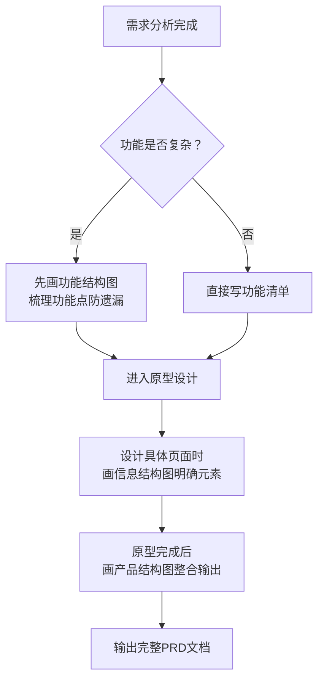

![[Pasted image 20260220194337.png]]
> 基于视频内容《产品经理零基础入门（三）流程图制作精讲课程》整理

---

## 一、🎯 可直接套用的模板部分

### 1️⃣ 功能结构图模板（以"手机相册"为例）

```
📱 图库APP（产品/模块）
│
├── 🖼️ 图片管理（子模块）
│   ├── 查看图片（功能）
│   ├── 编辑图片（功能）
│   ├── 分享图片（功能）
│   ├── 删除图片（功能）
│   └── 下载/保存图片（功能）
│
├── 🎬 视频管理（子模块）
│   ├── 查看视频（功能）
│   ├── 剪辑视频（功能）
│   ├── 分享视频（功能）
│   └── 删除视频（功能）
│
├── 📁 相册分类（子模块）
│   ├── 新建相册（功能）
│   ├── 重命名相册（功能）
│   ├── 移动图片/视频（功能）
│   └── 删除相册（功能）
│
└── ⚙️ 系统设置（子模块）
    ├── 清理缓存（功能）
    ├── 备份同步（功能）
    └── 隐私权限设置（功能）
```

📌 **命名规范**：
- 功能点 = 动词 + 名词（如"查看图片"），名词可省略（如"编辑"默认指编辑图片）
- 层级关系：产品 → 模块 → 子模块 → 功能点（建议3-4层以内）

---

### 2️⃣ 信息结构图模板（以"图片详情页"为例）

```
📄 页面：图片详情页
│
├── 🖼️ 图片展示区
│   ├── 主图（高清图片资源）
│   ├── 缩略图导航条
│   ├── 加载占位图
│   └── 加载失败提示文案
│
├── 📝 信息展示区
│   ├── 图片标题（文字）
│   ├── 拍摄时间（日期格式）
│   ├── 文件大小（KB/MB）
│   ├── 拍摄地点（地理位置）
│   └── 标签/分类标识
│
├── 🔘 操作按钮区
│   ├── 分享按钮（图标+文案）
│   ├── 编辑按钮（图标+文案）
│   ├── 删除按钮（图标+文案）
│   └── 更多操作（下拉菜单）
│
└── 💬 互动反馈区
    ├── 点赞数（数字+图标）
    ├── 评论入口（文案+数量）
    └── 收藏状态（已收藏/未收藏）
```

📌 **核心区分**：信息结构图关注"页面上有什么内容"，而非"用户能做什么操作"

---

### 3️⃣ 产品结构图模板（整合页面+功能+信息）

```
📱 图库APP 产品结构
│
├── 🏠 首页
│   ├── 顶部：搜索框 + 分类Tab（图片/视频/相册）
│   ├── 中部：内容网格展示区（缩略图+标题+时间）
│   └── 底部：导航栏（首页/相册/我的）
│
├── 🖼️ 图片详情页
│   ├── 图片轮播区 + 手势操作（缩放/滑动）
│   ├── 信息浮层（标题/时间/地点，可收起）
│   └── 底部操作栏（分享/编辑/删除）
│
├── ✏️ 图片编辑页
│   ├── 编辑画布（实时预览）
│   ├── 工具栏（裁剪/滤镜/文字/涂鸦）
│   └── 操作区（撤销/重做/保存/取消）
│
└── 👤 个人中心页
    ├── 用户信息卡片
    ├── 功能入口列表（云备份/设置/帮助）
    └── 版本信息 footer
```

📌 **产品特点**：按"最终产品长什么样"来组织，每个节点对应真实页面

---

## 二、🧭 抽象方法论部分

### 🔑 核心认知：三类结构图的本质区别

| 维度       | 功能结构图      | 信息结构图       | 产品结构图      |
| -------- | ---------- | ----------- | ---------- |
| **关注点**  | 能做什么（动词导向） | 看到什么（内容导向）  | 长什么样（页面导向） |
| **核心元素** | 功能点、操作行为   | 字段、文案、图片、状态 | 页面、模块、交互路径 |
| **使用阶段** | 需求分析→原型设计前 | 原型设计过程中     | 原型完成后整合输出  |
| **输出目的** | 梳理功能清单，防遗漏 | 明确页面信息元素    | 呈现完整产品架构   |
| **类比理解** | 功能清单的树状可视化 | 页面线框图的内容清单  | 产品地图+导航手册  |

---

### 🔄 功能结构图绘制方法论（5步法）

```
Step 1：明确产品定位
   ↓ 问自己：这个产品核心解决什么问题？用户是谁？

Step 2：场景脑暴功能
   ↓ 按用户旅程拆解：用户会用这个产品做什么？
   ↓ 技巧：用"用户想要___"句式列举（如"用户想要分享照片"）

Step 3：功能归类分层
   ↓ 按业务逻辑分组（展示类/操作类/管理类/设置类）
   ↓ 构建层级：模块→子模块→功能点（保持3-4层）

Step 4：命名规范化
   ↓ 功能点 = 动词(+名词)，如"查看""编辑""分享"
   ↓ 同一层级保持命名风格一致

Step 5：完整性校验
   ↓ 检查：是否覆盖所有用户场景？是否有逻辑断层？
   ↓ 输出：将结构图转化为功能清单表格
```

✅ **适用判断**：
- 功能复杂/模块多 → 必须画功能结构图
- 简单MVP/功能少 → 可直接写功能清单，跳过此步

---

### 🧩 信息结构图绘制方法论（4步法）

```
Step 1：锁定目标页面
   ↓ 明确当前梳理的是哪个具体页面

Step 2：区域拆解
   ↓ 按视觉分区：头部/主体/底部/浮层/弹窗

Step 3：元素罗列
   ↓ 每个区域细化到：文字/图片/按钮/输入框/状态提示
   ↓ 标注属性：静态展示 / 动态加载 / 用户输入

Step 4：交互关联
   ↓ 标注点击某元素后的反馈（跳转/弹窗/Toast提示）
```

💡 **关键区分**：
- ❌ "分享按钮"是功能，"分享文案+图标"是信息
- ❌ "编辑功能"是操作，"编辑工具栏"是信息载体

---

### 🗺️ 产品结构图绘制方法论（闭环思维）

```
核心原则：页面即节点，路径可追溯

Step 1：梳理核心用户路径
   ↓ 例：打开APP→浏览→点击→详情→编辑→保存→返回

Step 2：确定页面清单
   ↓ 列出所有必要页面，避免孤立页面

Step 3：页面内结构填充
   ↓ 每个页面下融合"信息结构+功能入口"

Step 4：标注跳转关系
   ↓ 用箭头/备注说明页面间如何流转

Step 5：整体评审
   ↓ 检查：路径是否闭环？是否有死胡同？是否冗余？
```

---

### ⚡ 通用绘制技巧 & 避坑指南

#### ✅ 高效技巧
- **颗粒度控制**：功能拆解到"可独立开发测试"的粒度
- **版本管理**：结构图标注版本号/日期，随需求迭代更新
- **协作标注**：用颜色/符号标记优先级（P0/P1/P2）、负责人、状态
- **工具推荐**：XMind/ProcessOn/墨刀，支持层级折叠+导出

#### ❌ 常见误区
| 误区 | 正确做法 |
|------|---------|
| 混淆"功能"和"信息" | 功能是动词（能做啥），信息是名词（看到啥） |
| 层级过深（>4层） | 考虑拆分模块，或合并细粒度功能 |
| 为画图而画图 | 结构图是工具不是目的，复杂时才用 |
| 忽略"本期不做" | 明确标注V1.0范围，避免需求蔓延 |
| 命名风格混乱 | 同一层级统一用"动词+名词"或纯动词 |

---

### 🎯 决策框架：什么时候用哪种图？



---

> 💡 **一句话总结方法论**：  
> **功能图理清"做什么"，信息图明确"展示啥"，产品图整合"长怎样"——三者递进，按需使用，避免过度设计。**

如需我针对某个具体产品帮你套用模板，或进一步细化某类结构图的绘制步骤，可以随时告诉我~ 🚀