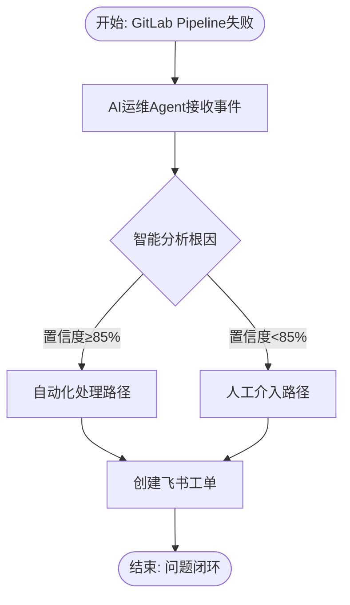
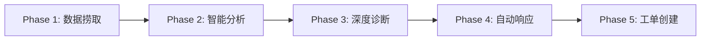
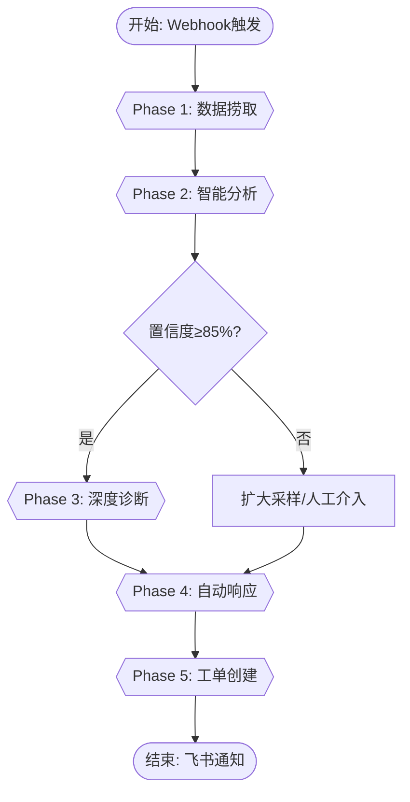
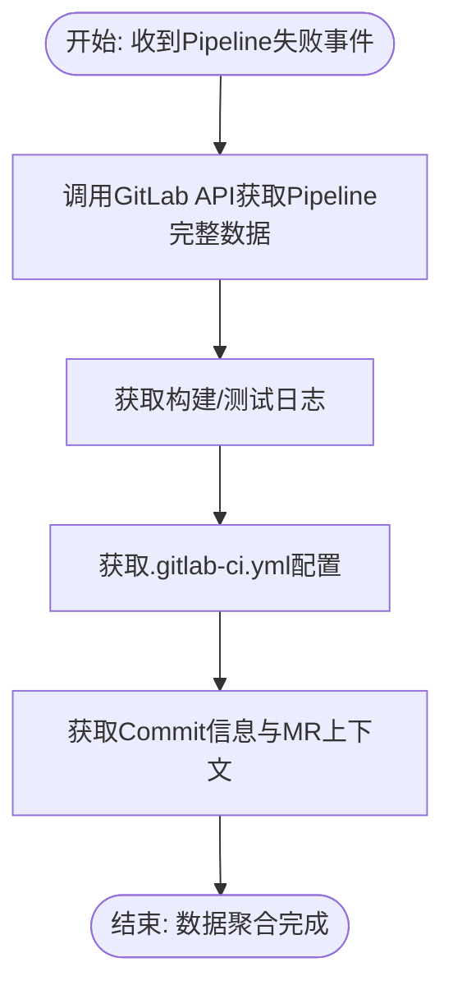
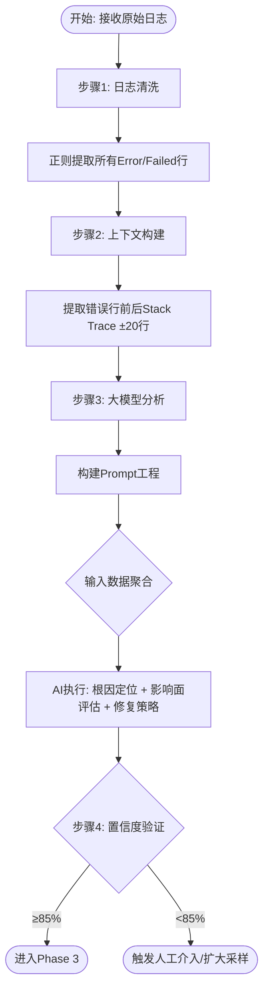
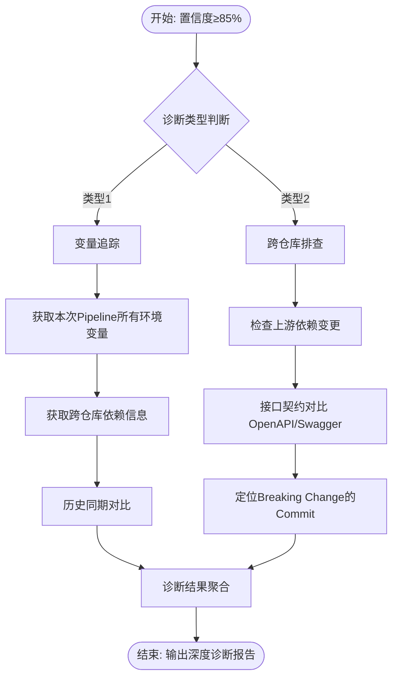
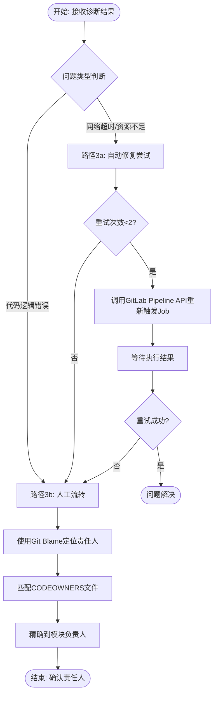
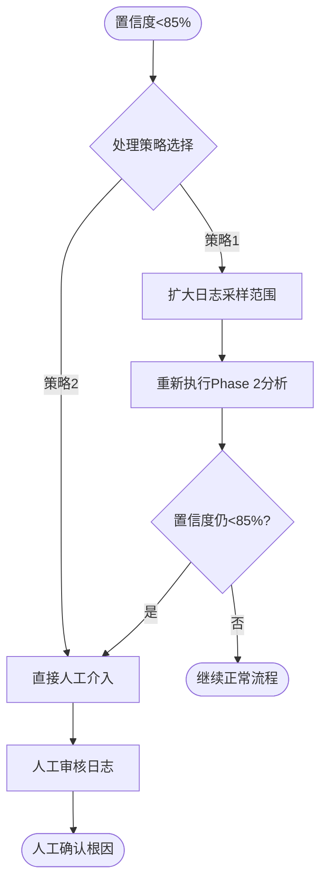
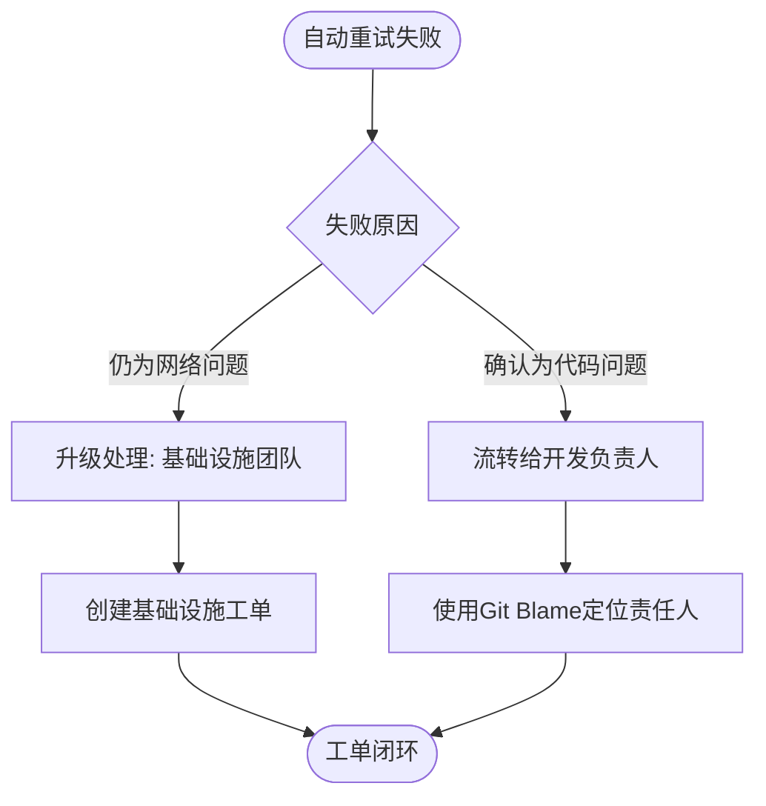

# AI运维Agent·GitLab CI/CD故障处理流程图

本文档按照标准流程图方法论,从宏观到微观描述AI运维Agent的完整处理逻辑。

---

## 一、业务流程图（宏观层）

### 1.1 业务闭环总览



### 1.2 业务价值说明
- **触发条件**: GitLab CI/CD Pipeline执行失败
- **核心目标**: 自动定位故障根因,减少人工排查时间
- **输出产物**: 飞书Bug工单(含根因分析+修复建议)

---

## 二、功能流程图（中观层-页面/阶段流转）

### 2.1 阶段划分总览



### 2.2 完整阶段流程图



---

## 三、详细功能流程图（微观层-具体步骤）

### 3.1 Phase 1: 数据捞取流程



**数据清单:**
- Pipeline完整执行数据（失败状态筛选）
- 构建/测试日志（多Job日志聚合）
- 流水线配置(.gitlab-ci.yml)
- Commit信息、MR上下文

### 3.2 Phase 2: 日志预处理与智能分析（核心决策）



**Prompt工程输入要素:**
- 错误日志
- 代码仓库结构
- 历史成功案例(Case库)

**AI输出任务:**
- 根因定位
- 影响面评估
- 修复策略

### 3.3 Phase 3: 深度诊断流程



**诊断维度:**
- **变量追踪**: 环境变量、跨仓库依赖、历史同期对比
- **跨仓库排查**: 关联仓库变更、接口契约变化、Breaking Change定位

### 3.4 Phase 4: 自动化响应决策分支



**分支规则:**
- **自动修复**: 网络超时、临时资源不足（限2次重试）
- **人工流转**: 代码逻辑错误，需定位责任人

### 3.5 Phase 5: 工单创建与通知

```mermaid
graph TD
    START([开始: 确认处理方案]) --> CLASSIFY[问题分类判定]
    CLASSIFY --> TYPE1{类型: 环境抖动}
    CLASSIFY --> TYPE2{类型: 代码逻辑错误}

    TYPE1 --> CREATE1[创建飞书工单]
    TYPE2 --> CREATE2[创建飞书工单]

    CREATE1 --> FILL[填充工单字段]
    CREATE2 --> FILL

    FILL --> FIELD1[根因总结 AI生成]
    FILL --> FIELD2[修复建议 含代码片段]
    FILL --> FIELD3[关联Pipeline链接]
    FILL --> FIELD4[@责任人 Git Blame结果]

    FIELD1 --> NOTIFY[发送飞书通知]
    FIELD2 --> NOTIFY
    FIELD3 --> NOTIFY
    FIELD4 --> NOTIFY

    NOTIFY --> END([结束: 工单闭环])
```

**工单字段清单:**
- 根因总结（AI生成）
- 修复建议（含代码片段）
- 关联Pipeline链接
- @责任人（Git Blame结果）

---

## 四、异常流程处理

### 4.1 置信度不足分支



### 4.2 重试失败分支



---

## 五、流程图绘制规范遵循

### 5.1 使用的标准元素

| 元素名称 | 图形形状 | 使用场景 |
|---|---|---|
| 开始/结束 | 圆角矩形 | 流程起点/终点 |
| 处理步骤 | 矩形 | 具体执行动作 |
| 判定/决策 | 菱形 | 条件判断分支 |
| 子流程 | 带双竖线矩形 | 引用独立Phase |

### 5.2 逻辑结构说明

- **顺序结构**: Phase 1→2→3→4→5 的主流程
- **选择结构**:
  - 二元选择: 置信度判定 (≥85%/<85%)
  - 多元选择: 问题类型分类 (环境抖动/代码错误)
- **循环结构**: 重试机制 (最多2次)
- **子流程引用**: 各Phase作为独立子流程

### 5.3 闭环原则验证

✅ 所有非结束节点均有出口
✅ 所有非开始节点均有入口
✅ 异常流程均有明确处理路径
✅ 无死循环设计 (重试有上限)

---

## 六、产品思维复盘

### 6.1 三层思维拆解

| 层级 | 关注点 | 产出物 |
|---|---|---|
| 宏观层(业务) | AI运维如何降低故障排查成本? | 业务闭环总览 |
| 中观层(阶段) | 需要经历哪些处理阶段? | Phase划分流转 |
| 微观层(功能) | 每个阶段具体怎么执行? | 详细步骤流程 |

### 6.2 核心设计决策

1. **置信度阈值设计**: 85%作为自动/人工的分界线,平衡效率与准确性
2. **重试次数限制**: 最多2次,避免无限循环浪费资源
3. **多维度诊断**: 变量追踪+跨仓库排查,覆盖复杂场景
4. **工单字段标准化**: 根因+建议+链接+责任人,信息完整可追溯

### 6.3 可能的优化方向

- [ ] 增加历史案例库的自动学习机制
- [ ] 支持多租户隔离(不同项目独立诊断)
- [ ] 增加修复建议的代码自动生成能力
- [ ] 对接更多协作平台(钉钉/企业微信)

---

**文档版本**: v1.0
**创建日期**: 2026-03-04
**适用范围**: AI运维Agent产品设计评审
