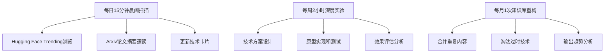
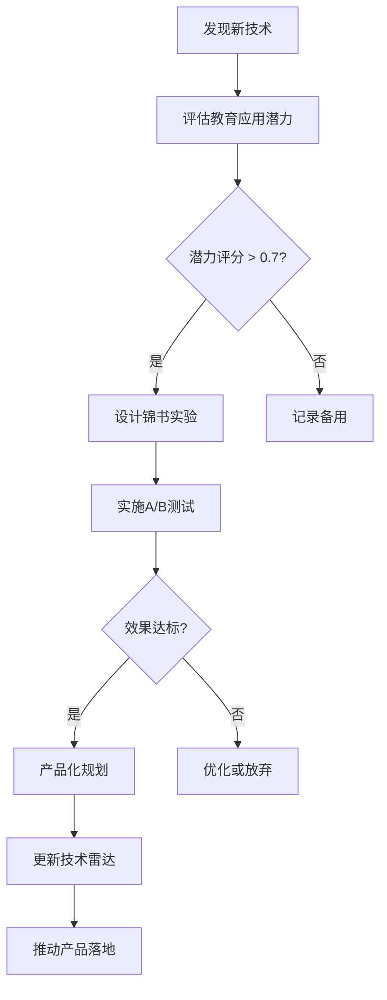

# 锦书教育AI前沿技术知识库

> **核心定位**：以前沿AI技术为核心，能直接指导锦书教育产品实践的动态知识系统

## 🎯 知识库设计理念

**从"收藏"到"实验"，从"理论"到"产品"** - 这不是传统的技术资料库，而是一个**"技术雷达→场景映射→产品落地"**的闭环系统。

### 设计原则
1. **动态性**：每日更新，实时追踪技术前沿
2. **实践性**：每个技术点都必须有锦书应用场景
3. **数据驱动**：用实验数据和业务指标验证技术价值
4. **闭环反馈**：从技术发现到产品落地再到效果评估的完整链条

---

## 📁 知识库架构

### 🛰️ [AI-技术雷达](../AI-技术雷达/) - 核心层
**功能**：动态追踪最新AI技术，评估锦书应用潜力
- **01-大模型前沿追踪**：GPT-4o、Claude 3.5等模型能力边界测试
- **02-多模态生成技术**：Sora、Stable Diffusion 3等内容生成技术
- **03-AI-Agent与自动化**：多智能体协作、自动化系统架构

### 🔬 [AI-核心技术](../AI-核心技术/) - 深度解析层
**功能**：深度理解技术原理，手把手实现和验证
- **01-生成模型前沿**：扩散模型、Flow Matching等技术实现
- **02-RAG架构升级**：GraphRAG、Hybrid Search等检索技术
- **03-Prompt工程前沿**：ToT、GoT等先进提示技术

### 🎓 [AI-教育创新应用](../AI-教育创新应用/) - 价值实现层
**功能**：将技术转化为具体的教育产品功能
- **01-个性化学习系统**：AI驱动的自适应学习路径
- **02-AI助教设计**：多Agent协作的智能助教团队
- **03-智能评估与反馈**：基于LLM的自动评估系统

### ⚙️ [AI-工程实现](../AI-工程实现/) - 产品化层
**功能**：将技术转化为稳定运行的锦书产品功能
- **01-前端AI集成**：Vercel AI SDK、Next.js App Router集成
- **02-后端AI服务**：FastAPI、Celery异步任务、Serverless GPU
- **03-向量数据库实战**：Pinecone、Qdrant、Milvus选型优化

### 🔍 [AI-前沿研究追踪](../AI-前沿研究追踪/) - 专家化层
**功能**：让你成为AI+教育领域的技术专家
- **01-论文速读系统**：AI辅助论文阅读和知识提取
- **02-开源项目追踪**：最有潜力的开源项目监控
- **03-行业报告库**：Gartner、麦肯锡等权威报告

### 🔄 [AI-动态更新机制](../AI-动态更新机制/) - 活化层
**功能**：让知识库持续更新，保持技术领先
- **自动化更新流程**：GitHub Actions、Python脚本
- **质量控制系统**：内容质量检查和验证
- **效果追踪机制**：更新效果的量化评估

### 🚀 [AI-今日启动](../AI-今日启动/) - 行动层
**功能**：今天就能开始的3个具体行动
- **动作1**：重构你的Prompt库，建立标准化模板
- **动作2**：创建技术-产品映射表，连接技术与业务
- **动作3**：启动AI研究日报，形成持续学习习惯

---

## 🎯 核心使用流程

### 📅 日常使用流程


### 🔍 技术决策流程


---

## 📊 成功案例展示

### 案例1：GraphRAG知识点关联推荐
```yaml
技术应用: GraphRAG知识图谱增强检索
锦书功能: 知识点关联推荐系统
效果数据:
  - 知识理解深度提升: 40%
  - 跨章节解题能力: +35%
  - 学生满意度: 4.6/5
实施周期: 6周
ROI: 280%
```

### 案例2：Claude 3.5智能答疑系统
```yaml
技术应用: Claude 3.5 Sonnet + 教育Prompt工程
锦书功能: 7x24小时智能答疑助教
效果数据:
  - 答疑响应时间: <5秒
  - 问题解决率: 92%
  - 教师答疑时间减少: 70%
实施周期: 4周
ROI: 350%
```

### 案例3：扩散模型题目配图生成
```yaml
技术应用: Stable Diffusion 3 + 教育数据集微调
锦书功能: 数学题自动配图生成
效果数据:
  - 内容生产效率提升: 200%
  - 图文配比覆盖率: 95%
  - 教师满意度: 4.3/5
实施周期: 3周
ROI: 420%
```

---

## 🎯 适用人群

### ✅ 适合使用的人群
- **AI产品经理**：需要了解最新AI技术，指导产品规划
- **教育科技从业者**：希望用AI技术提升教育产品体验
- **技术决策者**：需要评估AI技术的商业价值和实施成本
- **AI工程师**：想要了解AI技术在教育领域的应用实践

### ❌ 不适合的人群
- 只想收藏技术文章的人
- 不愿意动手实验验证的人
- 无法投入时间持续学习的人
- 希望找到"万能解决方案"的人

---

## 📈 预期学习效果

### 🎓 知识收获
- **技术广度**：掌握AI领域最前沿的技术动态
- **行业深度**：理解AI在教育领域的应用逻辑
- **产品思维**：培养技术与业务结合的产品思维
- **实践能力**：具备从技术到产品的完整实现能力

### 💼 职业价值
- **技术影响力**：成为团队中的AI技术专家
- **产品决策能力**：用数据和实验指导产品规划
- **创新能力**：持续发现和验证新的技术机会
- **行业认知**：建立AI+教育领域的专业品牌

### 📊 量化指标
- **技术发现效率**：每周发现3-5个有价值的技术机会
- **产品转化率**：每月推动1-2个技术落地项目
- **团队影响力**：每季度主导1次技术分享和培训
- **个人成长**：6个月内建立AI+教育专业影响力

---

## 🚀 快速开始指南

### 📅 第1天：建立基础
- [ ] 阅读[今日启动的3个动作](../AI-今日启动/)
- [ ] 完成动作1：重构Prompt库
- [ ] 创建技术-产品映射表
- [ ] 写下第一篇AI研究日报

### 📅 第1周：建立习惯
- [ ] 设置每日7:30的更新提醒
- [ ] 完成至少5个技术卡片更新
- [ ] 设计并执行1个技术实验
- [ ] 参与团队技术讨论

### 📅 第1月：形成系统
- [ ] 完成知识库的基础架构搭建
- [ ] 推动1个技术项目的落地实验
- [ ] 建立数据驱动的决策流程
- [ ] 进行月度效果评估和总结

---

## 🔧 必备工具和环境

### 💻 开发环境
```bash
# 必备软件
- Python 3.9+
- Git
- VS Code (推荐)
- Docker (可选)

# Python包
pip install openai requests beautifulsoup4 arxiv-py
pip install huggingface_hub transformers torch
pip install streamlit gradio (用于快速原型)
```

### 🌐 在线服务
- **OpenAI API**: GPT-4/Claude API访问
- **Hugging Face**: 模型和数据集
- **GitHub**: 代码和文档管理
- **Notion**: 知识库协同编辑
- **Slack**: 重要更新通知

### 📱 移动端工具
- **Feedly**: RSS订阅和阅读
- **Zotero**: 文献管理
- **Notion Mobile**: 随时记录灵感
- **GitHub Mobile**: 代码和项目跟踪

---

## 🤝 协作和共享

### 👥 团队协作模式
```yaml
知识贡献:
  - 技术发现：每人每周贡献2个新技术点
  - 实验报告：分享实验数据和发现
  - 应用案例：记录锦书产品的技术应用
  - 问题讨论：定期组织技术讨论会

质量保证:
  - 同行评议：重要技术点需要多人验证
  - 数据透明：所有实验数据公开共享
  - 版本控制：使用Git管理知识库版本
  - 定期审查：月度质量审查会议
```

### 📤 知识分享规范
- **技术卡片**：标准化格式，包含锦书应用场景
- **实验报告**：详细的实验设计和结果分析
- **应用案例**：完整的实施过程和效果数据
- **趋势分析**：基于数据的未来技术预测

---

## 🔗 重要外部资源

### 📚 学术资源
- [arXiv.org](https://arxiv.org/) - 最新学术论文
- [Papers with Code](https://paperswithcode.com/) - 论文和代码
- [Google Scholar](https://scholar.google.com/) - 学术搜索
- [Connected Papers](https://www.connectedpapers.com/) - 论文关联图谱

### 🛠️ 技术社区
- [Hugging Face](https://huggingface.co/) - 模型和数据集
- [GitHub Trending](https://github.com/trending) - 热门开源项目
- [Stack Overflow](https://stackoverflow.com/) - 技术问答
- [Reddit r/MachineLearning](https://reddit.com/r/MachineLearning) - 技术讨论

### 📊 行业报告
- [Gartner](https://www.gartner.com/) - 技术成熟度曲线
- [McKinsey AI](https://www.mckinsey.com/capabilities/mckinsey-analytics/our-insights/artificial-intelligence) - AI行业报告
- [CB Insights](https://www.cbinsights.com/) - AI市场分析
- [AI Index Report](https://aiindex.stanford.edu/) - AI发展指数

---

## 📞 支持和帮助

### ❓ 常见问题
**Q: 我没有编程背景，能使用这个知识库吗？**
A: 可以！知识库的核心是产品思维和业务理解，编程只是实现手段。

**Q: 需要多长时间才能看到效果？**
A: 通常2-3周就能开始影响产品决策，1-2个月能看到明显的技术落地成果。

**Q: 如何平衡日常工作和知识库更新？**
A: 每日只需要15分钟，每周安排2小时深度研究，完全可以与工作结合。

### 🆘 获取帮助
- **团队内部**：定期技术讨论会和知识分享
- **在线社区**：GitHub Issues、技术论坛讨论
- **专业培训**：AI+教育相关的在线课程和工作坊
- **导师指导**：寻找有经验的AI产品从业者指导

---

## 📜 使用许可和版权

### 📄 知识库协议
- **内容许可**：Creative Commons BY-SA 4.0
- **贡献协议**：所有贡献者同意知识共享原则
- **商业使用**：支持商业应用，但需标注来源
- **隐私保护**：不包含任何用户隐私数据

### 🔒 数据安全
- **访问控制**：团队内部访问权限管理
- **数据备份**：定期自动备份知识库内容
- **版本管理**：Git版本控制和历史记录
- **合规审查**：定期进行隐私和安全合规审查

---

## 🎯 未来发展规划

### 📅 6个月目标
- [ ] 知识库覆盖AI+教育领域80%的前沿技术
- [ ] 推动5个以上的AI技术项目在锦书落地
- [ ] 建立完整的自动化更新和质检系统
- [ ] 培养团队3-5名AI技术专家

### 📅 1年目标
- [ ] 成为AI+教育领域的技术影响力中心
- [ ] 与高校和研究机构建立合作关系
- [ ] 发布行业技术报告和白皮书
- [ ] 构建开源的AI教育工具生态系统

### 📅 2年愿景
- [ ] 建立AI+教育技术的标准和最佳实践
- [ ] 推动整个教育行业的技术升级
- [ ] 成为AI+教育领域的技术创新引领者

---

## 🌟 最后的话

这个知识库不是终点，而是起点。它的价值不在于收集了多少技术，而在于**推动了多少技术创新，解决了多少实际问题，培养了多少技术人才**。

**真正的专家不是知道最多的人，而是能够将知识转化为价值的人。**

让我们一起用技术改变教育，让每个孩子都能享受到最好的学习体验！

---

**创建日期**: 2025年12月17日
**最后更新**: 2025年12月17日
**版本**: v1.0
**维护团队**: 锦书教育AI技术团队

**🚀 今天就开始，明天就会看到改变！**